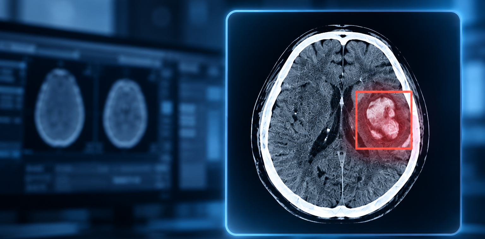

# Brain Bleed Detection and Evaluation

This project contains data exploration and performance evaluation of three AI algorithms for detecting
intracranial hemorrhage (brain bleeds) on CT scans, deployed across two hospital
sites, each split into two patient departments (emergency vs. regular
hospitalization). This project compares three algorithms and translates the findings into recommendations for three key audiences: performance improvements for the Algo team, workflow improvements for the Product team, and operational improvements for the Ops team.

> All data is synthetically generated for this project and contains no real
> patient information.

<p align="left">
  
</p>


## Background

Intracranial hemorrhage (ICH) is a condition involving bleeding within the skull and a time-critical finding on CT scans, where faster detection and intervention can significantly improve patient outcomes. AI triage tools are increasingly deployed alongside radiologists to
flag likely-positive scans so they can be pulled out of an otherwise
first-in-first-out reading queue and reviewed sooner.

This project simulates exactly that setup: three independently trained
detection algorithms, deployed across two hospital sites, each scanning every
case in parallel and producing a positive/negative call. Radiologists still
read every scan independently, regardless of the algorithms' predictions -
the radiologist's read is the ground truth used to evaluate the algorithms.
This analysis evaluates whether, and how well, each algorithm is actually fit
for that role: from a classification-accuracy, operational-speed, and
deployment-workflow perspective.

## Key findings

- Patient volume is unevenly split: one site handles roughly 70% of all scans
  versus 30% at the other, and inpatients outnumber ED cases at both sites
  (72% vs. 28%), in each hospital seperatly and also in overall.
- **The overall positive rate for ICH is 9.5%** (4.7% in the ED and 11.4% for inpatients), resulting in a notable class imbalance. With such a low prevalence, a trivial “always negative” classifier would already achieve ~90% accuracy, making other performence metrics more informative.
- The three algorithms occupy very different points on the sensitivity-PPV (recall-precision) tradeoff. **Algo1 is the most conservative model**, achieving the highest precision (76%) and specificity (98%), but the lowest sensitivity (51%), meaning it misses nearly half of the positive cases. **Algo2 is the most aggressive model**, achieving the highest sensitivity (92%), but at the cost of the lowest precision (14%) and specificity (43%), which means 86% of its alerts being false positives. **Algo3 provides the most balanced performance**, ranking second in both sensitivity (74%) and specificity (97%) and achieving the highest F1-score (0.73).
- Despite the prevalence gap between classes, algorithm rankings stay consistent: across all of the combinations per site × class, every metric except accuracy preserves the same ranking of algorithms seen in the overall numbers.
- Algo3 is also ~13x slower than the fastest algorithm (10 min mean runtime vs. 45s) and far less consistent, with a much wider spread of runtimes. That's not just a performance footnote: the entire point of deploying these algorithms is to pull positive scans forward in the radiologist's queue, so an algorithm too slow to act on undermines its own purpose. In practice, algo3 only beats the radiologist's own independent read on 46% of scans overall, compared to 99-100% for algo1 and algo2 - **meaning that for the other 54% of scans, algo3's output arrives too late to actually speed up the read it was meant to prioritize**.
- Pairwise agreement tells a more nuanced story. Algo1 and Algo3 agree on 93% of scans, but this is driven almost entirely by shared negative calls on true negatives, which dominate the dataset. When we restrict the comparison to true positive scans, the cases with the greatest clinical significance, the highest agreement is between Algo2 and Algo3, at 77%. **Together with its highest sensitivity of the three, as noted earlier, this agreement with Algo3 makes Algo2 the strongest choice when detecting true positives is the priority**.

## Repo structure

```
├── brain_bleed_detection_and_evaluation.ipynb    # full walkthrough, Part 1 + Part 2
├── data_loader.py                                # load + clean + derive fields
├── exploration.py                                # Part 1: demographics, duration, prevalence, volume
├── performance.py                                # Part 2: confusion matrices, metrics, agreement, actionability
├── viz.py                                        # plotting for both parts
├── ICH_data.csv                                  # dataset 
├── requirements.txt
├── readme_banner.png
└── README.md
```

## Data

20K rows, each row is one CT scan, two sites, two departments, three algorithms. 

| Column | Description |
|---|---|
| `accession` | Unique scan identifier. |
| `site` | Hospital name. |
| `patient_class` | `ED` = emergency department patient, `IN` = inpatient (regular hospitalization). |
| `gender` | Patient's gender |
| `age` | Patient's age |
| `scan_timestamp` | When the CT scan was acquired, recorded automatically by the scanner. |
| `radiologist_answer` | Ground truth: the radiologist's independent read, `P` (positive) or `N` (negative) for ICH. |
| `radiologist_sign_time` | When the radiologist finished independently interpreting the scan. |
| `algos_start_run` | When all three algorithms began analyzing the scan (in parallel), after it reached the server. |
| `algo1_answer` / `algo2_answer` / `algo3_answer` | Each algorithm's prediction: `P` (positive) or `N` (negative). |
| `algo1_finish_run` / `algo2_finish_run` / `algo3_finish_run` | When each algorithm finished processing the scan. |

## Running it

```bash
pip install -r requirements.txt
jupyter notebook brain_bleed_detection_and_evaluation.ipynb
```

## Recommendations

**Algo**
- Improve algo3's runtime first: a 3-4x reduction (to roughly 150-200s)
  without changing its classification logic would make it the strongest
  option across every axis evaluated here.
- Reduce algo2's false-positive rate: perhaps raising its decision threshold
  slightly could meaningfully improve precision without giving up much
  sensitivity.
- Raise algo1's true-positive count: this is its most significant weakness of this algo which makes 
  the other two more superior in comparison.

**Product**
- Differentiate alerts by algorithm reliability: since the three algorithms
  carry very different error profiles, their alerts could be visually
  distinguished for radiologists in the UI rather than presented uniformly.
- Build a retrospective-review workflow for algo3: while too slow for
  real-time triage, it could still run after the fact to flag cases the
  faster algorithms got wrong, route them for review, and feed confirmed
  misses back as training data.

**Ops**
- Give algo3 dedicated compute resources, which may resolve its runtime
  bottleneck.
- Investigate why one site's ED reads show no speed advantage over inpatient
  reads, unlike the other site. This could reflect a deliberate site
  practice, or an infrastructure issue silently blocking triage
  prioritization.
- Investigate the gap in how quickly algorithms begin processing after scan
  acquisition between the two sites, roughly double at one vs. the other. the absolute impact is minor, but closing it could still help.
